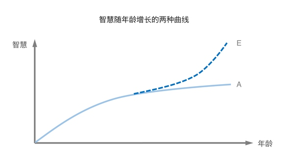
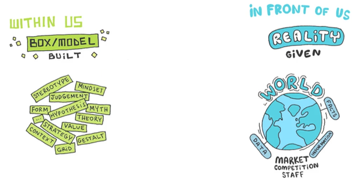

> 人一切的迷茫都来自：信息不足×思考不足。无论是寻找真爱之人，还是寻找毕生事业。信息量不足就没有选择的依据，思考不足就没有选择的原则，最后只能无从选择。
>
> 千万不要以为当下的困境是最重要的，更重要的是目前的困境揭示了什么，其实是在提醒你：知道的太少、思考的太少、不知道自己到底要什么。
> 
> 即便你磕磕绊绊度过这次困境，核心问题不解决，下次纠结的困境自然会找上你。90％的人都在蹉跎中过一生，迷茫、纠结、无知、无助、哀怨伴随一生，都因为不正视问题的根源

现在的你，比三年前更有智慧吗？

我问过很多朋友这个问题，得到最多的答案是没有。有些朋友甚至感叹一句：现在还不如读大学的时候呢，那时候比现在聪明。我相信相当一部分朋友是谦虚。毕竟随着工作时间越来越长，经验越来越多。年龄越来越大，阅历也随之增加。除非你在做机械的工作，或过着机械的生活，人的智慧怎么能不提高呢？

但有趣的是，大部分人智慧的提高也仅限于此。如下图中的曲线A，这种提高受限于时间，以年为单位，缓慢而被动。此外，很明显这种提高是边际递减的，很多人在中年时，智慧慢慢达到一种较为稳定的状态。

我认为这是造成很多人职业天花板的一个主要原因之一。从某种意义上来说，这有点像是耗尽了自己的潜力和积累。

那我们有没有可能摆脱这种曲线呢？

如果我们可以找到一种方法，主动的系统性提高自己的智慧，那么曲线A就会转变成曲线E。主动系统的智慧提高可能开始时不起眼，但却是在积累势能，从本质上它是指数式的，随着长期的坚持，我们的智慧也越来越远离普通人的平均水平。

***这种主动系统性地智慧提升，很多时候并不来源于平时的工作***

大概有几个原因：

* 除去少数经历特别或运气好的人，一般在开始工作的数年里，我们都是很难决定自己做什么事、以及去什么岗位的。这就使得学习东西的范围相对狭窄
* 有很多职位有一半以上的工作是重复性的，这就限制了学习东西的速度。
* 有很多职位只需要高中毕业的教育水平，就可以无障碍的完成工作。这会让人无法体会到提升智慧的必要性，享受智慧提升带来的快感

当然，不排除有人的工作每天都充满挑战，或如大学教授一样，需要不断提高自己的智慧。但对一般人来说，我认为是否能在平时工作之外，找到一种方法，主动的系统性提高自己的智慧，部分决定了他/她可以走多远。

那么如何系统的提高自己的智慧呢？

读一本书，和一个更有智慧的朋友交谈，都是对智慧的一种提高。但这里的关键词是系统地。有时候会有些惊讶，很多人对于生活工作中的小事精明谨慎，对于像提高自己智慧这种问题却出人意科的忽视和盲目。

所以才会有“读了很多书，但是都忘掉了，读书的意义在哪里？”这种问题，才会有罗辑思维下面这种类型的产品出现。

如果像做其他事一样，对智慧提升过程有更深入的思考，和系统的方法，会大大加快我们成长的速度和收获，最终迎来指数曲线的拐点。

在这方面，我们是幸运的。有很多非常有智慧的人分享了他们的经验和心得，比如巴菲特和他的合伙人芒格，诺贝尔物理学奖得主，著名的理论物理学家理查德·费曼，图灵奖和诺贝尔经济学奖得主赫伯特·西蒙等……

这是我想通过接下来的一些文章，和分享大家的内容。我没有聪明到把这一切自己弄清楚，但幸运的是我们可以站在巨人的肩膀上。

2013年的一次访谈中，主持人问巴菲特和芒格，为什么他们可以远超同龄人和竞争对手。芒格说：
> 因为对于那些本来比我们聪明的人，我们学到了变得比他们更聪明的方法
> 
> 智慧是一种运用知识、经验、理解、常识和洞见进行思考和行动的能力

在我过去的公司里，我们常说一句话：“做任何事的时候，一定要记得从消费者的角度思考问题。”但如果我们仔细思考这句话，就会发现这是不可能的。如果我是一个洗发水品牌的管理者，全国13亿人，几乎可以假定所有人都是我们的消费者，我们如何从13亿人的角度思考问题？即便这个品牌是一个面向18-25岁男性的洗发水品牌，这个群体，也有超过6000万人口。

所以，另一句话我们也常用：当你做一个品牌的时候，你要闭上眼想一想，你周围的人里谁是这个品牌最准确的目标消费者？他/她有什么样的消费习惯和偏好？当我们说“考虑消费者”的时候，有两种可能，一种是我们考虑很多关于消费者的概念，类似“他是一个对生活品质有要求的年轻男性”，“他喜欢挑战”等。还有一种是我们去想某一个特定的符合标准的人。

这其实是一个有趣的启示。如果你想考虑6000万人，你必须要学会忘记99.99%的人。

***在建立了抽象的概念、标签、分类以后，你才能真正开始思考。***

正如下图所画的，右侧是我们眼前的真实世界，左侧是我们脑中的世界。真实世界有海量的事实、数据、信息等等，纷繁复杂的，且无时不在变化。

如何理解这个复杂的现实世界呢？

**我们建立对这个现实世界的简化模型。**

**这些模型可以是一种分类**，比如彩虹包含一切可见光，是连续光谱，是无穷尽的颜色集合，我们把这一难理解的物理事实安置到一个尺寸相对比较合适、更容易管理的框架中：彩虹是七色的，红、橙、黄、绿、蓝、靛、紫。

**这些模型也可以是关于事实的一个模糊的概念**，每个人都可以自信地说自己知道谷歌的标志是什么样子，那是由红黄蓝三原色组成的6个字母。不过你能准确无误地告诉我哪个颜色被使用了两次吗？你的模型只在某一程度上帮助你理解事物（在这里，它帮助你把谷歌的标志和其他公司的区分开来），却并不完美的反映现实。

你可以把大脑想象成一个巨大的冰箱，有隔层，也有抽屉。这是一个可以整理现实的混沌，并把一切变得井井有条的方法。我们都按照自己的意愿整理冰箱，把同类东西放在一起。若是没有把实际发生的事情做一个分类和排序，没有人可以应对如此纷繁复杂的人生。

这就像是我们玩的象棋游戏，现实世界就像是一个真实的战场，而我们在自己脑中建立了棋盘战场和楚河汉界。

#### 演绎和归纳

在清楚了这个游戏的背影设定后，我们考虑的下一个问题自然是：这个游戏的规则是什么？

回到上面的图，思考的时候，我们有两种行为。

**一种是我们从自己脑海移向真实的世界，另一种是从真实的世界移向脑海。前者叫演绎，后者叫归纳。**

演绎就像是数学公式的证明，一步一步推导，完全依赖于逻辑。A>B，B>C，所以A>C。如文章开始时的那个例子，当一个品牌对于目标消费者有了清楚的概念和分类，那么针对不同的消费者可以投放什么样的广告，怎样投放就是一种演绎。演绎源于我们的脑海，作用于现实世界产生影响。

归纳则恰恰现反。归纳源于现实世界的各种信息和事实。它是我们将一切串联、总结到脑海中，形成新的思维模型的过程。如果演绎是根据财务报表，分析企业亏损的来源和解决方案的话，那么归纳就是第一个发明财务报表这一思维模型的过程。

所以，沿着这样的思路，我们可以给思考下一个定义：

* 思考大概就是使用和建立思维模型的过程
* 智慧的第一步是学会质疑，质疑会把我们引向问题，问题会把我们引向真理

思维模型帮助我们简化世界，更加快速的思考，但同时也是禁锢我们的牢笼。

且不说一个狭隘片面的思维模型让晋惠帝闹了“百姓无粟米充饥，何不食肉糜？”的笑话，即使是最显而易见、最广为人知的思维模型与现实事实仍然是两回事。

财务报表应该是商业世界里使用最广泛的思维模型之一了。

但对于从15世纪改造至今的这个思维模型，我们依然可以提出很多的疑问：比如财务报表的净利润计算中，将应收账款计入营业收入，但这笔钱在现实中真的会收到吗？将折旧计入费用中，这一笔钱又真的支出了吗？

这些处理方法是这个模型的假设之一，当然有其合理性。这是我们对现实的简化，**但却不能过于执着于思维模型，而忽略了真实的世界。**

揣摩自己思维模型的本质，询问它存在的原因，努力理解它背后的假设和限制，这是我们通往智慧的第一步。

我相信，变得更有智慧的故事是一首自由的史诗：为了智慧，你必须先越狱，但在越狱之前，你必须首先意识到你是一个囚徒。

-

如何系统地提高自己的智慧呢？

一个直接的答案是阅读、学习，或找优秀的朋友交流。毫无疑问，这些都是很好的智慧来源，但问题是少有人反思我们学到的东西到底如何实用到我们的生活中。

你可能今天读了一本叫《从0到1》的畅销书，明天学习了一门MOOC上的经济学课程，后天和某大牛朋友促膝长谈两小时。你感觉收获了很多，生活很充实，但你的智慧在以最大的速度形成指数式的积累吗？学习从本质上来讲，一定是复利的。但为什么很少有人能享受到复利的巨大收益呢？

#### 从分散的概念到思维模式
思维模型是我们对真实世界的简化，可能是一个概念，一个分类等。

INSEAD教授，前BCG欧洲合伙人 Luc De Brabandere 在”What Managers Can Learn from Philosophy”课程指出，当我们思考时，其实是对这些思维模型进行处理的过程。他对“思考”的定义是：**思考就是使用和建立思维模型的过程**

但问题在于我们建立了很多的思维模型或独立的概念，但却无法将它们串联成一个有机的系统。正如查理·芒格所说：
> 基本的、普世的智慧是什么？嗯，第一条规则是，如果你们只是记得一些孤立的事物，试图把它们硬凑起来，那么你们无法真正地理解任何东西。如果这些事物不在一个理论框架中相互联系，你们就无法把它们派上用场。

> 你们必须在头脑中拥有一些思维模式。你们必须依靠这些模式组成的框架来安排你的经验，包括间接的和直接的。你们也许已经注意到，有些学生试图死记硬背，以此来应付考试。他们在学校中是失败者，在生活中也是失败者。你必须把经验悬挂在头脑中的一个由许多思维模式组成的框架上

这就是芒格著名的“格栅理论”。Peter Beverlin在”Seeking Wisdom”一书中有一个关于“思维模式”的进一步解释:
> 一个思维模式就是帮助我们更好的理解世界运转规律的想法。一个思维模式往往阐释了结果，并且回答了像“Why”和”How”这类问题。
> 
> 比如“社会认同”（心理学的一种理论）这一模式告诉我们当人们不确定时，他们经常自动选择模仿其他人做的事情，而不会想真正正确的事是什么。这样的理论解释了人们为什么做（Why），同时预测了在特定情景下人们又会如何做一件事（How）

再举个例子

你可能知道，在化学领域，有一种自催化（Autocatalysis）的现象。当一个化学反应的产物能够对这个反应的速率有进一步催化作用时，反应的速率以极快的速度提高，这种反应被称为自催化反应。在这种思维模式中，你只需要做A，但会得到A+B+C的效果。

作为一种典型的思维模式，这种自催化现象你可以在很多地方遇到。一个很明显的例子是亚马逊。关于亚马逊战略的总结

> 贝佐斯与其助理团队描绘了公司步入良性循环的前景，他们相信这会成为公司发展的强大动力。公司的未来蓝图是这样的：以更低的价格来吸引更多的顾客。更多的顾客意味着更高的销量，而且也会把付给亚马逊佣金的第三方销售商更多地吸引到网站来。这也会使亚马逊从固定成本中赚取更多的利润，如物流中心和运行网站的服务器。更高的效率会使价格进一步降低。他们推断，任何一个飞轮只要运行顺畅，就会加速整个的循环过程。
> —— 《一网打尽》

这其实是一种非常典型的自催化模式。

另一个应用自催化模式的例子是迪士尼。我一直私以为迪士尼是全球最好的商业模式之一。

迪士尼最重要的是做好一件事：电影制作。电影会产生巨额的收入，一个电影传播越广，这个电影的IP就越经典。迪士尼乐园、电影衍生品IP授权等其他的业务都会因此获益。更重要的是，这个模式是互相催化的。消费者越喜欢迪士尼乐园、购买电影的衍生品，也会进一步购买迪士尼出产的电影。

此外，你还可以发现和建立自己的自催化模式，来加速达到你的目标。

**建立思维模式是非常重要的。因为思维模式的丰富度和质量，决定了我们是否可以从更全面的角度思考问题，给出深入的解析**。

另一个有趣的例子来自著名的理论物理学家，诺贝尔物理学奖得主费曼。他在普林斯顿读博士期间，经常溜去数学系，为那些天才的数学系博士生解决他们解决不了的问题。他在《别闹了，费曼先生》一书中，透露了他的秘密
> …我在麻省理工或普林斯顿的朋友被某些积分难住，原因却是他们从学校学来的标准方法不管用。如果那是围道积分或级数展开，他们都懂得怎么把答案找出；现在他们却碰壁了。这时我便使出“积分符号内取微分”的方法——这是因为我有一个与众不同的工具箱。当其他人用光了他们的工具，还没法找到解答时，便把问题交给我了

“积分符号内取微分”的方法就是费曼不一样的“思维模式”的一种。费曼因为拥有不一样的“工具箱”，所以可以解出天才的数学系博士生都无法解决的问题。

我们很多人每天工作、阅读和学习，形成了很多概念、记住了很多散布各领域的事实和结论，但却没有主动的寻找和总结类似的思维模式形成自己与众不同的工具箱，这无疑是提高智慧过程中缺失的重要一环。

从某种意义上说，提高智慧的过程，就是不断通过阅读和学习发现掌握新的思维模式，充实我们工具箱的过程。

#### 你需要同时使用多种思维模式
诺贝尔经济学奖得主，卡内基梅隆大学计算机科学和心理学教授 Herbert Simon 是首次提出思维模式这一思想的人。他在自传”Models of My Life”中写到：

> 非常有经验的决策者和新手一个很大的不同不是那些无形的“直觉”，如果我们能够进入非常有经验的决策者的脑海，会发现 1) 他们很清楚所有可能的行动，2) 在行动之前，他们有一个要思考问题的核查清单，3) 他们脑子里有一个机制在相关的决策环境出现时，可以唤醒所有相关的清单事项
> 
不同的思维模式，或思考问题的角度构成了Herbert Simon所说的”核查清单”。很明显，只掌握一种思维模式是远远不够的，但这恰恰是很多人的现状。芒格尖锐的指出
>
> 你必须拥有多元思维模型——因为如果你只能使用一两个，研究人性的心理学表明，你将会扭曲现实，直到它符合你的思维模型，或者至少到你认为它符合你的模型为止。你将会和一个脊椎按摩师一样——这种医师对现代医学当然是毫无所知的。
>
> 那就像谚语所说的：“在手里拿着铁锤的人看来,每个问题都像钉子。”当然，脊椎按摩师也是这样治病的。但这绝对是一种灾难性的思考方式，也绝对是一种灾难性的处世方式。所以你必须拥有多元思维模型。

生活中，我们可以找到很多“拿着锤子找钉子”的人。有趣的是，有时候如果一个人在一个领域越擅长，他就越倾向于认为自己的思维模式适合解决世界上大部分的问题。

有一个典型的例子是《长尾理论》的作者，《连线》杂志的总编辑 Chris Anderson。关于这一点，Tim Wu 有一篇精彩的评论，告诉了我们一个优秀的人因为单一思维模式所带来的局限。

对应的，如果你可以同时掌握多种思维模式，你解决问题的能力会成倍地提升，因为你有更多获得问题答案的角度和方法。这也是真正优秀的人，如费曼、芒格，与一般人的区别：**他们有更多的思维模式可以自由的使用**。

巴菲特评价芒格：“他有这个世界上最聪明的30秒头脑。他一次就能把从A到Z全部想全。你还没有说完，他已经看到了一切的本质。”

#### 获得多学科思维模式
那么，我们如何获得更多的思维模式呢？

方法有两种。

第一种，也是最直接的一种就是大量的有意识的练习。每个领域的专家，很多都是在这种训练中逐渐建立自己独特的思维模式的。在这方面有两本书可以参考，一本是格拉德威尔举世闻名的《异类》，另一本是”Talent is over rated”（中文译：《哪来的天才》），在这里不赘述。

我们聊一下第二种：如何通过阅读和学习获得。

我相信很多人平时都会做大量的阅读，读微信公众号的最近文章，媒体的报道等，但这些都很难让我们获得新的思维模式，因为大量的文章都是实时性的，是一种信息和谈资的获取。过了一定的时间，你掌握的信息就不再有价值，这种情况下，当然不会有智慧的积累，所以很难产生曲线E的效果。

前面提到过，一个思维模式就是帮助我们更好的理解世界运转规律的想法。这些思维模式一定是非常固定的，很少改变，同时揭示了现实世界的一部分规律。所以第二种方法是通过学习重要学科，特别是基础学科的重要理论。
芒格指出：
> …这么说吧，第一条规则是，你必须拥有多元思维模型。这些模型必须来自各个不同的学科——因为你们不可能在一个小小的院系里面发现人世间全部的智慧。所以让我们来简单地看看哪些模型和技巧构成了每个人必须拥有的基础知识，有了这样的基础知识之后，他们才能够精通某项专门的艺术，比如说选股票.

在这一点上，John Reed, 在”Succeeding”一书进一步补充到
> 当你首先可以学习一个领域时，好像你要学习上百万件事情。
> 你其实不必如此。
> 你只需要识别出这个领域最核心的原则——一般只有3-12个。你觉得你要记住的上百万的事情，不过是这些核心原则的不同组合而已

查理·芒格也提到:
> 你们也许会说：“天哪，这太难做到啦。”但是，幸运的是，这没有那么难——因为掌握八九十个模型就占了90%的权重，差不多能让你成为拥有普世智慧的人了。而在这八九十个模型里面，非常重要的只有几个

查理·芒格的更详细阐述，请见1994年在南加州大学马歇尔商学院的经典演讲或《穷查理宝典》

**通过学习和运用几个，最多几十个各个学科最基本的原理或模型，就有机会显著的提高自己的智慧，这是一件多么合算的事情**

#### 从这里出发
读得越多，就越相信这种方法是系统地提高我们智慧的最佳方法之一。

有一次，当被问到如何变得更聪明时，巴菲特举起来一叠纸，说：

> 每天阅读这样大小的500页书。知识就是这样积累起来的，就像复利一样

芒格也有一段让人触动的话

> 我们大量的阅读。
在我所见过的所有有智慧的人里，没有任何一个人是不大量阅读的。
但这还远远不够：你需要有这种个性，可以抓到关键并且真正领会它们。大部分人不能抓到正确的想法，或者并不知道之后要怎么做

这三个段落是芒格上面这句话的解释。但它们更像是骨架，而每个人自己智慧的血肉还需要自己来填充。这三个段落从来不是追寻智慧旅程的终点，我也希望在后面的文章中，不断分享更具体的思维模式，更多的方法和思考。

**但我相信它们是一个好的起点。让我们开始主动地、系统地提高自己的智慧**